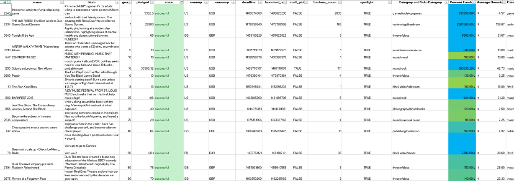
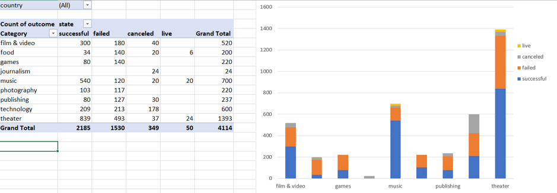
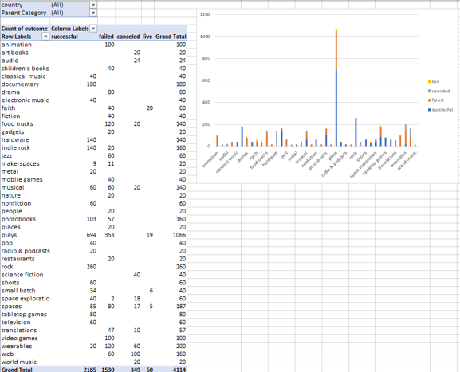
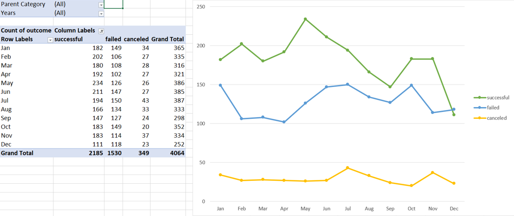
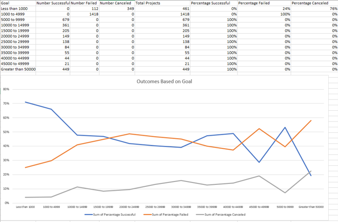

# Kickstarter-Analysis-with-Excel

This analysis uncovers market trends in data on 4,000 past Kickstarter Campaigns with Excel. The report below walks through my process. GitHub does not work well with Microsoft Excel, but GitHub serves as my portfolio. Check out the Excel workbook in Google Drive [here](https://drive.google.com/drive/folders/1BR3mQV0Lyo3iH9gysSrx1d_AQ3Zy_wj2?usp=sharing). The Excel workbook must be downloaded to use the interactive features. 

## Tools
Microsoft Excel 
Google Drive
 
 
# Process
## Modify Data
1. Reviewed data and used conditional formatting to color code the "state" column to easily see if a campaign was successful, failed, or canceled. 
2. Created a "Percent Funded" column and color coded it for readability.
    

    Conditional formatting was used to fill each cell in the "Percent Funded" column using a three-color scale. The scale starts at 0 and be a dark shade of red, transitions to green at 100, and blue at 200.
    

    
 
    *This image is filtered by success in the "stat" column. 

## Analysis
3. Created a pivot table and stacked column pivot chart showing a count of campaigns that were successful, failed, canceled, or live by category. All this can be filtered by country.
    

     This required two new columns, "Category" and "Sub-Category", which use formulas to split the "Category and Sub-Category" column into two.
    

    

 
 
4. Created a pivot table and stacked column pivot table showing a count of campaigns that were successful, failed, canceled, or live by sub-category. All this filtered by country and parent-category. 
 

 
 
5. Created pivot table and chart line graph that shows the count of successful, failed, canceled campaigns by month of "Date Created." 
 

 
 
6. Created a line chart that graphs the relationship between a funding goal's amount and its changes at success, failure, or cancellation. 
    

    The following was required: 
    - Created a new sheet for data on counts and percentages of successful, failed and canceled campaigns by funding goal ranges.   
    - Used the COUNTIFS() formula to count how many successful, failed, and canceled projects were created with funding goals within the new ranges.  
    - From that, calculated respective percentages.
    

## Key Insights
### Conclusions drawn about Kickstarter Campaigns: 
* Plays are popular Kickstarter Campaigns. They outnumber other types of campaigns and drive the higher number of campaigns in the Theater parent category. 
* A high number of Kickstarter Campaigns happen in the United States.  
* May seems to be a good month to launch Kickstarter Campaigns. May sees the most campaign launches and a high number of successful campaigns at that. 
### Limitations of this dataset:
*	Most of the Kickstarter Campaigns happen in the United States. This is a limitation of the dataset if we are looking for trends in other countries.
* Kickstarter started launching campaigns in 2009 and we only have data until 2017. Kickstarter Campaigns have higher numbers in the later years. We are certainly missing significant data from March 16, 2017 to December 2020. 
### Further analysis:  
* I would like to see success rates of campaigns given category, dates, and location. A graph would help visualize that data. 
* I am interested if staff picks and spotlight campaigns have better success rates or funding rates. A graph would help visualize that data as well. 
* If I were planning my own Kickstarter campaign, I would want to see what kind of goals and average donations other campaigns in my category had. 

# Contact Info:
### Hope Neely 
Email: [hope.neely@gmail.com](hope.neely@gmail.com) 
LinkedIn : [https://www.linkedin.com/in/hopeneely/](https://www.linkedin.com/in/hopeneely/)
